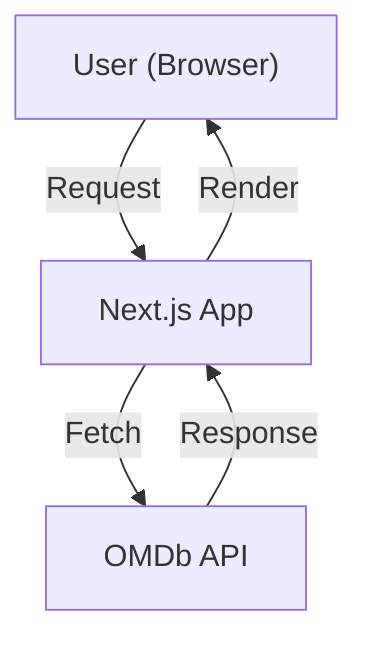

# Fetching Movie Data from OMDb: AI Editor Process

---

## 1. Overview & Purpose

This document guides AI code editors and developers on how to fetch movie details from the OMDb API in this Next.js app. It covers secure API key management, fetching patterns, error handling, testing, troubleshooting, and future extensibility. All code examples are provided in both TypeScript and JavaScript where relevant.

---

## 2. OMDb API & API Key Setup

### 2.1. Register for OMDb API Key
- Sign up at [OMDb API](https://www.omdbapi.com/apikey.aspx) to get your API key.

### 2.2. Environment Variable Setup
- **Local Development:**
  - Create a `.env.local` file in the project root:
    ```env
    NEXT_PUBLIC_OMDB_API_KEY=your_omdb_api_key_here
    ```
- **Netlify/Production:**
  - In Netlify dashboard, go to Site Settings → Environment Variables.
  - Add `NEXT_PUBLIC_OMDB_API_KEY` with your OMDb API key value.

> **Security Note:**
> `NEXT_PUBLIC_OMDB_API_KEY` is exposed to the client. OMDb keys are not sensitive, but for other APIs, use server-side variables (without `NEXT_PUBLIC_`).

---

## 3. Data Flow Diagram



---

## 4. Fetching Patterns

### 4.1. Server-Side Fetching (Recommended)
- Use for SEO, security, and performance.
- Example (TypeScript, in `src/lib/omdb.ts`):

```ts
const OMDB_API_KEY = process.env.NEXT_PUBLIC_OMDB_API_KEY;
const OMDB_BASE_URL = 'https://www.omdbapi.com/';

if (!OMDB_API_KEY) {
  throw new Error('OMDB_API_KEY is not set in environment variables');
}

export async function getMovieById(imdbID: string) {
  const url = `${OMDB_BASE_URL}?apikey=${OMDB_API_KEY}&i=${imdbID}&plot=full`;
  const res = await fetch(url, { cache: 'no-store' });
  const data = await res.json();
  if (data.Response === 'True') {
    return data;
  }
  return null;
}
```

**JavaScript version:**
```js
const OMDB_API_KEY = process.env.NEXT_PUBLIC_OMDB_API_KEY;
const OMDB_BASE_URL = 'https://www.omdbapi.com/';

if (!OMDB_API_KEY) {
  throw new Error('OMDB_API_KEY is not set in environment variables');
}

async function getMovieById(imdbID) {
  const url = `${OMDB_BASE_URL}?apikey=${OMDB_API_KEY}&i=${imdbID}&plot=full`;
  const res = await fetch(url);
  const data = await res.json();
  if (data.Response === 'True') {
    return data;
  }
  return null;
}
```

### 4.2. Client-Side Fetching
- Use only if you need dynamic updates after page load.
- Example (TypeScript, React):

```ts
import { useEffect, useState } from 'react';

export function useMovie(imdbID: string) {
  const [movie, setMovie] = useState(null);
  const [loading, setLoading] = useState(true);
  const [error, setError] = useState<string | null>(null);

  useEffect(() => {
    async function fetchMovie() {
      setLoading(true);
      setError(null);
      try {
        const res = await fetch(`/api/omdb?imdbID=${imdbID}`); // Or call OMDb directly if key is public
        const data = await res.json();
        if (data.Response === 'True') {
          setMovie(data);
        } else {
          setError('Movie not found');
        }
      } catch (e) {
        setError('Failed to fetch movie');
      } finally {
        setLoading(false);
      }
    }
    fetchMovie();
  }, [imdbID]);

  return { movie, loading, error };
}
```

---

## 5. Error Handling & User Feedback

- Always show loading and error states in the UI.
- Example (React):

```tsx
if (loading) return <div>Loading...</div>;
if (error) return <div className="text-red-500">{error}</div>;
if (!movie) return <div>No movie found.</div>;
```

- **Accessibility:**
  - Use ARIA roles and live regions for dynamic content.
  - Ensure error messages are visible to screen readers.

---

## 6. Testing the Fetch Logic

- **Manual:** Test with valid and invalid IMDb IDs.
- **Unit:** Mock fetch and test success/error branches.
- **E2E:** Use Playwright to test navigation, error, and loading states.

---

## 7. Troubleshooting

- **API Key Not Found:**
  - Ensure `NEXT_PUBLIC_OMDB_API_KEY` is set in `.env.local` and Netlify.
  - Restart dev server after changing env vars.
- **Network Errors:**
  - Check OMDb status and your network connection.
- **API Limits:**
  - OMDb free tier is limited to 1,000 requests/day. Upgrade if needed.
- **Debugging:**
  - Add `console.log(process.env.NEXT_PUBLIC_OMDB_API_KEY)` in server code to verify key is loaded (remove before production).

---

## 8. Rate Limiting and OMDb Free Tier

- OMDb free API keys are limited to 1,000 requests per day.
- If you exceed the limit, OMDb will return an error response.
- For higher limits, consider a paid OMDb plan.

---

## 9. Security Note

- `NEXT_PUBLIC_OMDB_API_KEY` is public and safe to expose for OMDb.
- For sensitive APIs, use server-only environment variables (no `NEXT_PUBLIC_` prefix) and fetch from the server.
- Never commit your `.env.local` file to version control.

---

## 10. Extending/Updating: Migrating to a Custom Backend

- For better security, caching, or aggregation, you can create a custom API route in Next.js:

```ts
// Example: src/pages/api/omdb.ts
import type { NextApiRequest, NextApiResponse } from 'next';

export default async function handler(req: NextApiRequest, res: NextApiResponse) {
  const { imdbID } = req.query;
  const OMDB_API_KEY = process.env.OMDB_API_KEY; // Use server-only variable
  const url = `https://www.omdbapi.com/?apikey=${OMDB_API_KEY}&i=${imdbID}&plot=full`;
  const omdbRes = await fetch(url);
  const data = await omdbRes.json();
  res.status(200).json(data);
}
```
- Update your client to fetch from `/api/omdb?imdbID=...` instead of OMDb directly.
- This approach hides your key and allows for custom logic (caching, rate limiting, etc.).

---

## 11. References
- [OMDb API Docs](https://www.omdbapi.com/)
- [Next.js Data Fetching](https://nextjs.org/docs/app/building-your-application/data-fetching/fetching)
- [Netlify Environment Variables](https://docs.netlify.com/configure-builds/environment-variables/)
- [Playwright Testing](https://playwright.dev/)

---

*Last updated: 2024-07-03* 